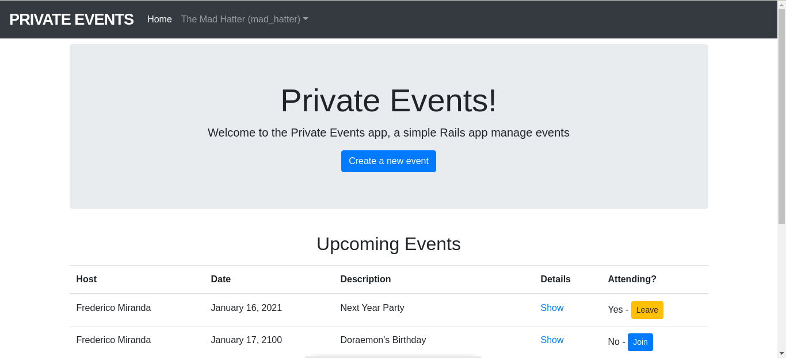

# PRIVATE EVENTS



## ABOUT THIS REPOSITORY

This repository stores a practice of Ruby on Rails which consists of creating a simple event manager. Users can register, create, join or leave events. Only registered users are able to join events, thus the name _private events_. The full description for this practice can be found at the following link: [The Odin Project - Ruby on Rails - Associations](https://www.theodinproject.com/courses/ruby-on-rails/lessons/associations)

## INSTALLING & GETTING STARTED

This guide for installation assumes that you have [Ruby on Rails]() installed on your local machine. If you do not, you'll need to install it first: [Installing Ruby](https://www.theodinproject.com/courses/web-development-101/lessons/installing-ruby), [Installing Rails](https://www.theodinproject.com/courses/web-development-101/lessons/your-first-rails-application).

If you are all set, the following sequence of commands may help you installing and getting started with seeing this practice in action in your local machine:

```
git clone https://github.com/elshaka/private-events
cd private-events
bundle install
rails db:migrate
rails server

```

## INTERACTING WITH THE APPLICATION (HOW TO USE IT)

After the application is up and running, you'll need to create a user account for creating and joining events. You can do that by visiting _/signup_. After the user is created, you'll need to login, which can be done by visiting _/login_. After logging in, the front page will give you options regarding how to create, join or leave events.

## TESTING

This project uses [Rspec](https://rspec.info/). The basic tests for checking if this project conforms
to the specification can be run with the following command at the root folder of the project.

```
rspec
```


## LIVE VERSION

[LIVE VERSION](https://mighty-reaches-54987.herokuapp.com/)

## AUTHORS

[Frederico Miranda](https://github.com/frederico-miranda)
[Eleazar Meza](https://github.com/elshaka)
